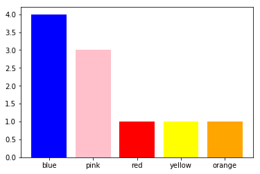

# NLP Course 2 Week 1 Lesson : Building The Model - Lecture Exercise 01
Estimated Time: 10 minutes
<br>
# Vocabulary Creation 
Create a tiny vocabulary from a tiny corpus
<br>
It's time to start small !
<br>
### Imports and Data


```python
# imports
import re # regular expression library; for tokenization of words
from collections import Counter # collections library; counter: dict subclass for counting hashable objects
import matplotlib.pyplot as plt # for data visualization
```


```python
# the tiny corpus of text ! 
text = 'red pink pink blue blue yellow WHITE WHITE ORANGE BLUE BLUE PINK' # 🌈
print(text)
print('string length : ',len(text))
```

    red pink pink blue blue yellow WHITE WHITE ORANGE BLUE BLUE PINK
    string length :  64


### Preprocessing


```python
# convert all letters to lower case
text_lowercase = text.lower()
print(text_lowercase)
print('string length : ',len(text_lowercase))
```

    red pink pink blue blue yellow white white orange blue blue pink
    string length :  64


```python
# some regex to tokenize the string to words and return them in a list
words = re.findall(r'\w+', text_lowercase)
print(words)
print('count : ',len(words))
```

    ['red', 'pink', 'pink', 'blue', 'blue', 'yellow', 'white', 'white', 'orange', 'blue', 'blue', 'pink']
    count :  12


### Create Vocabulary
Option 1 : A set of distinct words from the text


```python
# create vocab
vocab = set(words)
print(vocab)
print('count : ',len(vocab))
```

    {'blue', 'orange', 'white', 'pink', 'yellow', 'red'}
    count :  6


### Add Information with Word Counts
Option 2 : Two alternatives for including the word count as well


```python
# create vocab including word count
counts_a = dict()
for w in words:
    counts_a[w] = counts_a.get(w,0)+1
print(counts_a)
print('count : ',len(counts_a))
```

    {'red': 1, 'pink': 3, 'blue': 4, 'yellow': 1, 'white': 2, 'orange': 1}
    count :  6


```python
# barchart of sorted word counts
d = {'blue': counts_b['blue'], 'pink': counts_b['pink'], 'red': counts_b['red'], 'yellow': counts_b['yellow'], 'orange': counts_b['orange']}
plt.bar(range(len(d)), list(d.values()), align='center', color=d.keys())
_ = plt.xticks(range(len(d)), list(d.keys()))
```





```python
# create vocab including word count using collections.Counter
counts_b = dict()
counts_b = Counter(words)
print(counts_b)
print('count : ',len(counts_b))
```

    Counter({'blue': 4, 'pink': 3, 'white': 2, 'red': 1, 'yellow': 1, 'orange': 1})
    count :  6


### Ungraded Exercise
Note that `counts_b`, above, returned by `collections.Counter` is sorted by word count

Can you modify the tiny corpus of ***text*** so that a new color appears 
between ***pink*** and ***red*** in `counts_b` ?

Do you need to run all the cells again, or just specific ones ? 


```python
print('counts_b : ', counts_b)
print('count : ', len(counts_b))
```

    counts_b :  Counter({'blue': 4, 'pink': 3, 'white': 2, 'red': 1, 'yellow': 1, 'orange': 1})
    count :  6


Expected Outcome:

counts_b : Counter({'blue': 4, 'pink': 3, **'your_new_color_here': 2**, red': 1, 'yellow': 1, 'orange': 1})
<br>
count :  6

### Summary

This is a tiny example but the methodology scales very well.
<br>
In the assignment you will create a large vocabulary of thousands of words, from a corpus
<br>
of tens of thousands or words! But the mechanics are exactly the same. 
<br> 
The only extra things to pay attention to should be; run time, memory management and the vocab data structure.
<br> 
So the choice of approach used in code blocks `counts_a` vs `counts_b`, above, will be important.


```python

```
